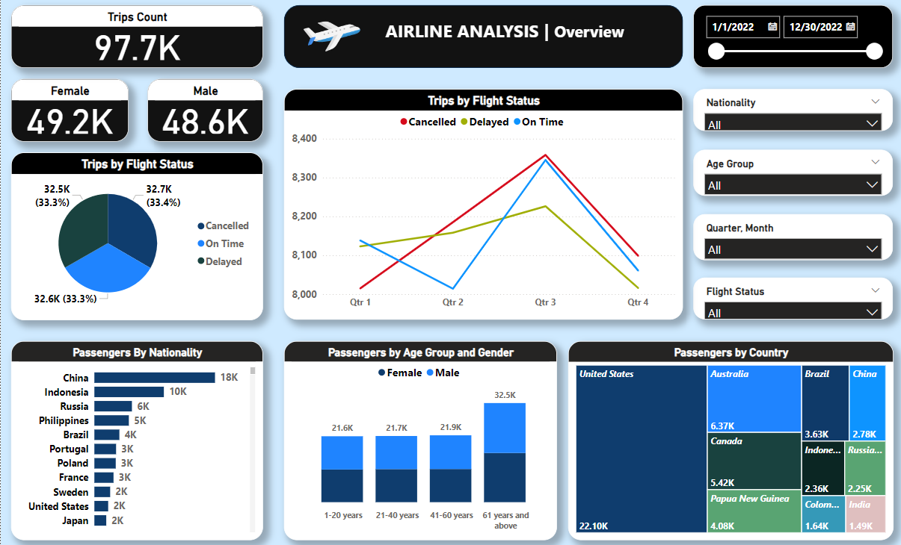
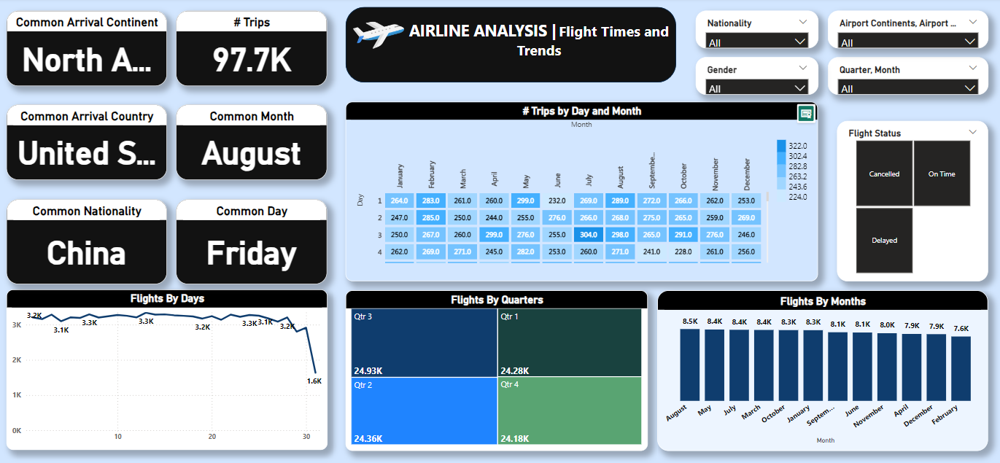

✈️ Airline Flight Analysis Dashboard
Welcome to the Airline Flight Analysis project! This repository is a comprehensive data analysis and visualization of airline flights aimed at uncovering key insights into traveler behavior and flight performance. Our goal is to provide clear, actionable intelligence for improving airline operations, enhancing customer experiences, and understanding key travel patterns.

## 📊 Dashboard Overview

Here is a snapshot of the **Airline Flight Analysis Dashboard** created in Power BI:

🌟 Objective
This project seeks to:

Deepen understanding of air travel trends and how they affect operational performance.
Identify areas of improvement to enhance efficiency and passenger satisfaction across various airline services.

📊 Scope of Analysis
Our analysis focuses on the following key areas:

Passenger Demographics: Analyzing gender, age, and nationality distribution.
Flight Performance: Tracking flight statuses, delays, and cancellations.
Operational Metrics: Measuring key performance indicators (KPIs) such as flight frequencies by month and quarter.
Geographical Analysis: Studying travel routes, with a focus on key countries like the USA, Australia, Guinea, Brazil, and China.
Trends: Identifying patterns in travel behavior over different periods, including peak seasons and busy routes.

🛠️ Technologies and Tools
Power BI: All analysis and visualization were conducted using Power BI, leveraging its powerful capabilities for creating insightful and interactive dashboards.

🔍 Insights Uncovered
Some of the key insights discovered in the analysis include:

Passenger Patterns: Most passengers travel between a few key routes, with certain months seeing significantly higher flight traffic.
Performance Metrics: The most common flight delays were observed in specific regions, allowing for targeted improvements.
Geographical Trends: Countries like the USA and China are prominent in global flight routes, making them critical hubs for further analysis.

🚀 Key Insights and Recommendations
1. Customer Satisfaction and Loyalty
Insight: A significant number of flights were delayed or canceled, impacting customer satisfaction.
Recommendation: Develop programs offering compensation (e.g., vouchers, loyalty points) for flight disruptions to enhance customer loyalty and mitigate dissatisfaction.
2. Balanced Marketing Campaigns
Insight: Gender-specific marketing can be unbalanced.
Recommendation: Launch campaigns that target both genders equally while considering their unique needs and preferences to optimize reach and engagement.
3. Senior-Friendly Services
Insight: Many passengers are aged 61 and above, requiring additional support.
Recommendation: Introduce senior-friendly services such as priority boarding, assistance with luggage, and better accessibility to enhance their travel experience.
4. Key Route Focus
Insight: The most critical routes are concentrated between USA, Australia, Guinea, Brazil, and China.
Recommendation: Prioritize and improve service quality and efficiency on these high-traffic routes to optimize performance.

📬 Contact
For inquiries, feedback, or collaboration opportunities, feel free to reach out:

Mostafa Gasser
Email:mostgasser1@gmail.com
Location: Cairo, Egypt

Let’s work together to turn your data into powerful insights! 🚀
